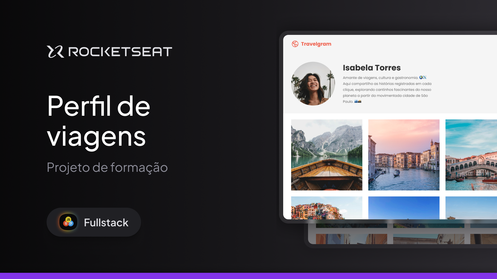

### 🧳 Travelgram — Perfil de Viagens

Este projeto é uma página estática desenvolvida com **HTML** e **CSS**, com foco no uso de **Flexbox** para criar uma interface visual moderna e bem distribuída. A proposta simula um perfil de rede social para amantes de viagens, destacando informações do usuário e uma galeria de imagens.

> 📌 Projeto **estático**, composto por **apenas uma página**, sem funcionalidades dinâmicas.

**Desenvolvido como parte de estudo de posicionamento e layout com CSS Flexbox durante aulas na [Rocketseat](https://www.rocketseat.com.br).**

--

## 🖼️ Prévia do Projeto

---

### 📋 Sobre o projeto

A página apresenta as seguintes seções:

- **Menu de navegação com logotipo e links**
- **Perfil da usuária com imagem, nome, descrição e estatísticas**
- **Galeria de imagens de viagens organizadas em layout flexível**
- **Rodapé com informações legais**

---

### 🛠️ Tecnologias Utilizadas

- **HTML5**
- **CSS3**

---

### 🔧 Possíveis melhorias futuras

- Responsividade para dispositivos móveis
- Animações leves com CSS
- Implementação de filtros na galeria de fotos
- Interatividade com JavaScript

---

### 👨‍💻 Autor

Desenvolvido por Wigor.  
Projeto fictício com fins educacionais.
